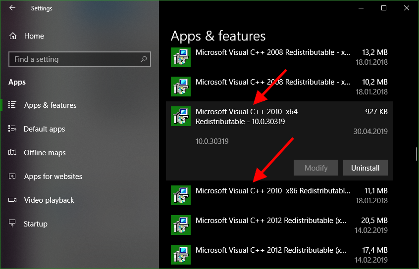
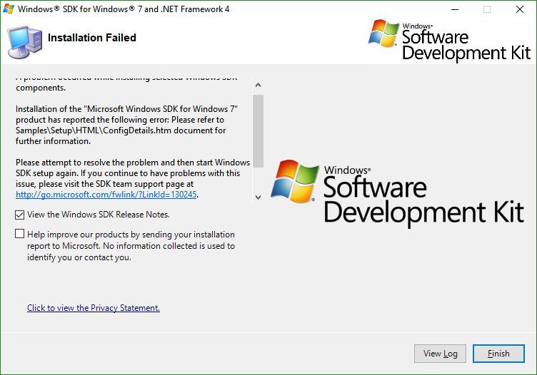
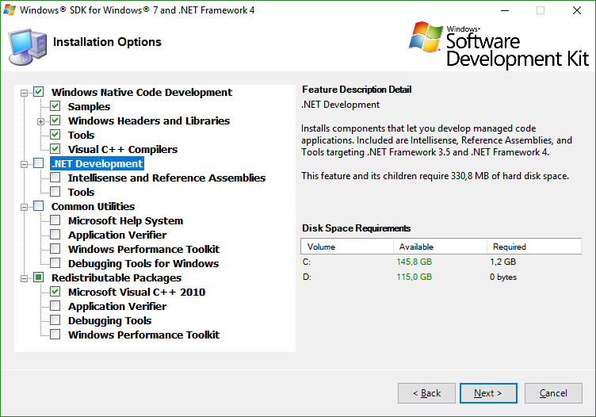

# Graal VM native image on Windows

## Installation

[Original guide](https://github.com/oracle/graal/tree/master/substratevm#quick-start)

1. Download and install [Microsoft Windows SDK for Windows 7](https://www.microsoft.com/en-us/download/details.aspx?id=8442)

    1. Make you there are no Microsoft Visual C++ 2010 Redistributable packages installed. If there are, uninstall them all (for both x86 and x 64).

        

        If the 2010 Redistributable packages are already present during the installation the installation [fails](https://social.msdn.microsoft.com/Forums/sqlserver/en-US/1de7c9b4-1feb-4c98-b426-f7f02cbafa99/windows-sdk-71-on-windows-10?forum=windowssdk#4088e371-94ff-4bdc-9187-22225d00586c) with message

        ```
        Installation of the "Microsoft Windows SDK for Windows 7" product has reported the following error: Please refer to Samples\Setup\HTML\ConfigDetails.htm document for further information.

        Please attempt to resolve the problem and then start Windows SDK setup again. If you continue to have problems with this issue, please visit the SDK team support page at http://go.microsoft.com/fwlink/?LinkId=130245.
        ```

        

    1. Mount the iso image and invoke `Setup\SDKSetup.exe`
    1. Options *Windows Native Code Development* and *Redistributable Packages > Microsoft Visual C++ 2010* are sufficient.
       
        

2. Download and extract [Graal VM snapshot]()

## Image creation

1. Create a source file `Foo.java`
   
    ```java
    public class Foo {

        public static void main(String[] args) {
            System.out.println("Hello world!");
        }
    }
    ```

2. Compile the source

    ```
    <graal-vm-dir>\bin\javac.exe Foo.java
    ```

3. Create the native image

    1. Open *Windows SDK 7.1 Command Prompt* in start menu
    2. Invoke the compilation from there

        ```
        <graal-vm-dir>\bin\native-image.cmd Foo
        ```

        If the output looks like

        ```
        >..\..\opt\graalvm\graalvm-ee-1.0.0-rc16-snapshot\bin\native-image.cmd Foo
        [foo:1276]    classlist:   2,954.67 ms
        [foo:1276]        (cap):     491.65 ms
        [foo:1276]        setup:   1,062.71 ms
        Error: Unable to compile C-ABI query code. Make sure GCC toolchain is installed on your system.
        Error: Use -H:+ReportExceptionStackTraces to print stacktrace of underlying exception
        Error: Image build request failed with exit status 1
        ```

        then the Windows SDK is most likely not propertly installed or the `native-image.cmd` is not invoded from *Windows SDK 7.1 Command Prompt*

        When the compilation finishes the directory content should look like this

        ```
        30.04.2019  14:45    <DIR>          .
        30.04.2019  14:45    <DIR>          ..
        29.04.2019  17:03               407 Foo.class
        30.04.2019  14:45         7 919 104 foo.exe
        30.04.2019  14:45         1 541 955 foo.exp
        11.04.2019  11:10               120 Foo.java
        30.04.2019  14:45         2 534 272 foo.lib
        30.04.2019  14:45         2 124 800 foo.pdb
        ```

        Resulting binary `foo.exe` is a selfcontained executable consisting of Substrate JVM and AOT compiled application code.
